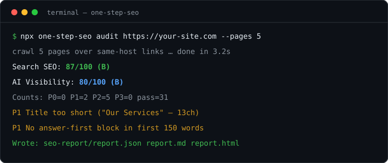

<p align="center">
  
</p>

<h1 align="center">one-step-seo</h1>

<p align="center">
  <strong>One command to audit any website for SEO + AI visibility.</strong><br>
  Zero-config CLI + AI skill. Two scores, never blended.
</p>

<p align="center">
  <a href="https://www.npmjs.com/package/one-step-seo"></a>
  <a href="https://github.com/6t9xstar/one-step-seo/actions/workflows/ci.yml"></a>
  <a href="./LICENSE"></a>
  <a href="./package.json">= 18"></a>
  <a href="https://github.com/6t9xstar/one-step-seo/stargazers"></a>
  <a href="https://github.com/6t9xstar/one-step-seo/network/members"></a>
  <a href="https://github.com/6t9xstar/one-step-seo/commits/main"></a>
  <a href="./CONTRIBUTING.md"></a>
</p>

A page can rank in Google yet be uncitable by ChatGPT, Perplexity, or AI Overviews — or the reverse. `one-step-seo` measures **both** and tells you exactly what to fix.

## See it in 30 seconds



```bash
npx one-step-seo audit https://your-site.com --pages 5
```

That one command checks technical SEO, on-page, content, schema, sitemap, performance hints, and GEO/AEO readiness — then writes `report.json` + `report.md` + `report.html` into `./seo-report/`.

## Contents

- [Quickstart](#quickstart)
- [Scores](#scores)
- [Features](#features)
- [Reports](#reports)
- [AI-agent usage](#ai-agent-usage)
- [Comparison](#comparison)
- [Docs](#docs)
- [Contributing](#contributing)

## Quickstart

```bash
# No install needed
npx one-step-seo audit https://example.com --pages 5 --out ./seo-report

# Single page deep dive
npx one-step-seo page https://example.com/pricing

# Schema: detect, validate, print a starter snippet
npx one-step-seo schema https://example.com --generate faq

# Sitemap / robots / llms.txt overview
npx one-step-seo sitemap https://example.com

# Sanity check
npx one-step-seo doctor
```

Open `./seo-report/report.html` in a browser or read `report.md`.

## Scores

| Axis                          | What it measures                                                                                                |
| ----------------------------- | --------------------------------------------------------------------------------------------------------------- |
| **Search SEO 0–100 (A–F)**    | Crawlability, indexability, title/meta/H1, canonical, sitemap, schema, internal links                           |
| **AI Visibility 0–100 (A–F)** | Answer-first opening, extractable facts/tables, FAQ coverage, entity consistency, `llms.txt`, AI-crawler access |

Bands: `A ≥90 · B ≥80 · C ≥70 · D ≥60 · F <60`

Real output (from [`examples/`](./examples/report-sample.md)):

```text
Search SEO: 87/100 (B)  |  AI Visibility: 80/100 (B)
Counts: P0=0 P1=0 P2=2 P3=0 pass=24
```

Priorities: **P0** critical (fix today) → **P1** high (this week) → **P2** medium (this month) → **P3** polish. Details: [`docs/SCORING.md`](./docs/SCORING.md). Full check list: [`docs/CHECKS.md`](./docs/CHECKS.md).

## Features

|                       |                                                             |
| --------------------- | ----------------------------------------------------------- |
| **Zero dependencies** | Plain Node 18+ ESM. No Python, no Playwright, no browser.   |
| **Any stack**         | Astro, Next.js, WordPress, Shopify, static HTML.            |
| **1–20 page crawl**   | `audit --pages N` walks same-host links automatically.      |
| **AI-agent ready**    | Ships `SKILL.md` for Claude Code, OpenCode, Codex, Cursor.  |
| **CI ready**          | Same command locally and in Actions, with report artifacts. |
| **Original + MIT**    | Not a fork. No tracking, reports stay on your machine.      |

## Reports

| File          | For                                          |
| ------------- | -------------------------------------------- |
| `report.json` | Machines — scores, counts, every finding     |
| `report.md`   | Humans — priority-ordered actions            |
| `report.html` | Sharing — single portable file (page 1 only) |

Preview: [`examples/report-sample.md`](./examples/report-sample.md) · [`examples/report-sample.html`](./examples/report-sample.html)

## AI-agent usage

Compatible with Claude Code, OpenCode, Codex, Cursor — anything that reads `SKILL.md`.

```bash
git clone --depth 1 https://github.com/6t9xstar/one-step-seo.git
cp one-step-seo/SKILL.md ~/.claude/skills/one-step-seo/SKILL.md
```

Or copy [`SKILL.md`](./SKILL.md) into your agent's skills folder and ask:

> "Audit https://my-site.com with one-step-seo and give me P0 fixes first."

Sub-skills: [`skills/seo-audit/SKILL.md`](./skills/seo-audit/SKILL.md) (audit → plan), [`skills/seo-fix/SKILL.md`](./skills/seo-fix/SKILL.md) (opt-in safe fixes, preview by default).

## Comparison

|                           | one-step-seo                 | claude-seo style plugins                 |
| ------------------------- | ---------------------------- | ---------------------------------------- |
| Install                   | `npx` — nothing to install   | Python venv + Playwright + setup command |
| Runtime                   | Zero-dep Node                | Python + browser + API keys              |
| Works outside Claude Code | Yes (any terminal, any CI)   | No (plugin only)                         |
| Pages per run             | 1–20 crawl built in          | Agent-dependent                          |
| Report                    | JSON + Markdown + HTML files | Chat transcript                          |
| License                   | MIT, original code           | MIT, fork-heavy                          |

## Docs

- [`docs/USAGE.md`](./docs/USAGE.md) — flags, formats, exit codes
- [`docs/CHECKS.md`](./docs/CHECKS.md) — all ~40 checks
- [`docs/SCORING.md`](./docs/SCORING.md) — dual-score math
- [`docs/CI.md`](./docs/CI.md) — GitHub Actions recipe

## Contributing

PRs welcome — especially new checks with fixtures. See [`CONTRIBUTING.md`](./CONTRIBUTING.md). Please follow the [`CODE_OF_CONDUCT.md`](./CODE_OF_CONDUCT.md). Security reports: [`SECURITY.md`](./SECURITY.md).

```bash
git clone https://github.com/6t9xstar/one-step-seo.git
cd one-step-seo
npm install
npm run check
```

## License

MIT — see [`LICENSE`](./LICENSE).

---

<p align="center">
  <a href="https://www.star-history.com/#6t9xstar/one-step-seo&Date"></a>
</p>

<p align="center">Star us if this saved you an audit. — <a href="https://github.com/6t9xstar/one-step-seo">6t9xstar/one-step-seo</a></p>
